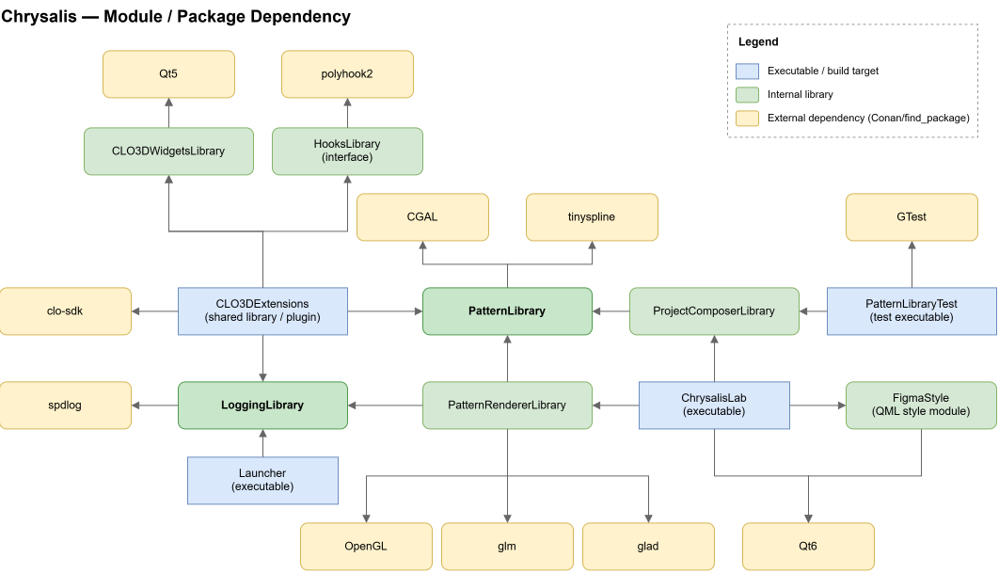

> ⚠️ This is a personal project in progress.

## Tech stack

C++23 · CGAL · OpenGL / GLSL · Qt / QML · Boost · CMake · Conan · PolyHook2 · GoogleTest

# Chrysalis

App which provides a way to build fashion design patterns in a form of **algorithm (script)** and can be integrated with other industry standard tools and apps (currently it's just CLO3D).
Does similar work as parametric CAD systems, however provides some fashion design specific functions and features to describe dependencies between pattern's points, edges, darts etc. 

## Build targets

**Chrysalis Lab (`lab/`) is the main application** — a standalone Qt QML app where user can create, visualize and export patterns.

**CLO3D Integration** (`integrations/clo3d`) — produces dynamic library and CLO3D launcher which injects this library on startup. Uses PolyHook2, official CLO3D API and Qt metadata system to extend app with new features.

Right now development is focused on main app. CLO3D part enables import of the pattern exported from "Chrysalis Lab" and adds development tools like UI exporter and logging.

### Other modules

| Module | Purpose                                                                                                                                                                                                                                                                              |
|---|--------------------------------------------------------------------------------------------------------------------------------------------------------------------------------------------------------------------------------------------------------------------------------------|
| `pattern` | Main module. Represents patterns as parametric instructions (`pattern/include/instructions`) evaluated through the constant or calculated arguments (`pattern/include/arguments`). Fires events when user input is changed or current rendered pattern is stale (used by `renderer`) |
| `pattern/composer` | Module which is used for testing and temporary it's providing macros and operator overloading to substitute scripting capabilities.                                                                                                                                                  |
| `renderer` | OpenGL/GLSL renderer of current pattern                                                                                                                                                                                                                                              |
| `integrations/hooks/` | Library wrapped around PolyHook2. Currently it's functional header only library, but will be refactored into static library in future.                                |
| `logging/` | Shared logging used across all modules.                                                                                                                                                                                                                                              |



Class diagrams are located in [`.docs/diagrams`](.docs/diagrams).

## Status

The main focus is collecting and implementing all required instructions which might be used for pattern creation. Scripting is not supported, but can be substituted by `pattern/composer` module. 

Examples (pattern/composer/src/Project1Composer.cpp `fillInstructions()`):

`_vector_(down, _param_(BACK_WAIST_LENGTH)) -> name(W)` - Add a new point "W" starting from last added point at distance equal to parameter "Back Waist Length" in down direction.

`_vector_(W, up, _length_(S, W) / 2) -> name(AH)` - Add a new point "AH" which is located at distance same as half of the distance between points "S" and "H" in upward direction.

`_expression_(MAX_INTAKE) = 2 + 4 + (2 << _option_(HAS_CENTER_BACK_DART) >> 0)` - Create a variable called "Max Intake" and assign 2 + 4 + 2 to it if "Has center back dart" option is enabled or 2 + 4 + 0 otherwise.

`edge(N, S2) -> dart(D, 90, 7)(2)` - Add perpendicular dart on the "N" - "S2" edge with length equal to 7 and intake equal to 2.

## Testing

Tests use **GoogleTest**, wired into CTest. On Linux, builds are compiled with **ASan/UBSan** and code coverage.

Current coverage on `pattern` (latest local run): **77.0% line coverage**, 52.3% function coverage. Coverage is uneven by design right now -- tests currently focus on verifying **point positions** produced by pattern instructions (the highest-risk area). Broader coverage of the remaining code is planned once input validation is implemented and the full set of required instructions/arguments is collected.

## Building

See build instructions below.

### 1. Create a Python virtual environment
**Windows**
```
python -m venv .python/venv
.python\venv\Scripts\activate
```
**Linux**
```
python3 -m venv .python/venv-linux
source .python/venv-linux/bin/activate
```

### 2. Install requirements and custom Conan recipes
```
python -m pip install --upgrade pip
pip install -r requirements.txt
conan export .recipes/polyhook2
conan export .recipes/clo-sdk
conan download "qt/5.15.16" -r conancenter --only-recipe
conan download "qt/6.8.3" -r conancenter --only-recipe
git restore .conan/p
```

### 3. Build dependencies
**Windows**
```
mklink /J C:\Chrysalis "%CD%"
cd C:\Chrysalis
conan install . --build=missing --output-folder=.conan -o '&:app=Chrysalis' -s build_type=Debug -pr:h win-host -pr:b win-build
conan install . --build=missing --output-folder=.conan -o '&:app=CLO3D' -s build_type=RelWithDebInfo -pr:h win-host -pr:b win-build
```
**Linux**
```
conan install . --build=missing --output-folder=.conan -o '&:app=Chrysalis' -s build_type=Debug -pr:h linux-host -pr:b linux-build
conan install . --build=missing --output-folder=.conan -o '&:app=CLO3D' -s build_type=RelWithDebInfo -pr:h linux-host -pr:b linux-build
```